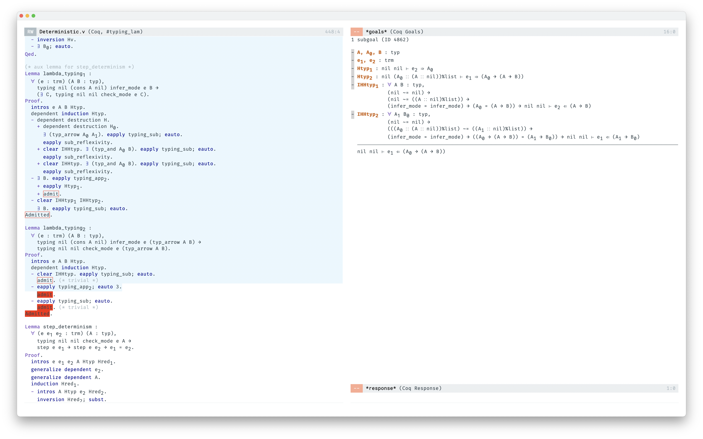
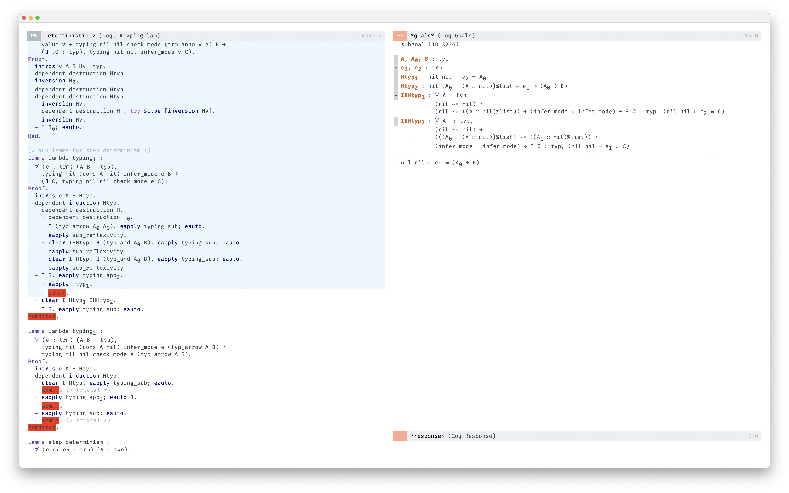
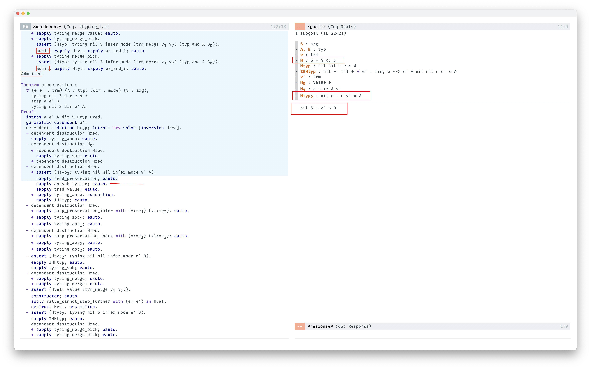
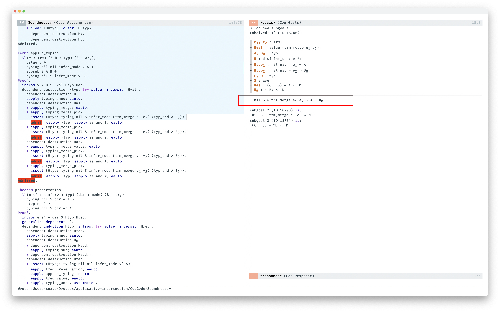

# Problem 1

A Lemma needs to be used in Determinsm

```
Lemma lambda_typing2 :
  forall (e : trm) (A B : typ),
    typing nil (cons A nil) infer_mode e (typ_arrow A B) ->
    typing nil nil check_mode e (typ_arrow A B).
Proof.
```

which is, if  `. ; A |- e  => A -> B`, then `. ; . |- e <= A -> B`

In the proof, by induction on   `. ; A |- e  => A -> B`,  there are three cases

* T-Anno (solved by subsumption)
* T-App
* T-Merge (solved by subsumption)

the problems lies on T-App (cannot be solved by subsumption is because we don't have a infer to lambda), after applyting T-App2

if we add a infer to lambda, progress theorem will break.

```
T |- e2 => A    T |- e1 <= A -> B
----------------------------------- TApp2
T |- e1 e2 <= B
```



I also tried to prove more general one,

```
Lemma lambda_typing1 :
  forall (e : trm) (A B : typ),
    typing nil (cons A nil) infer_mode e B ->
    (exists C, typing nil nil check_mode e C).
Proof.
```

the problem is the same



## Problem 2

```
Lemma appsub_typing :
  forall (v : trm) (A B : typ) (S : arg),
    value v ->
    typing nil nil infer_mode v A ->
    appsub S A B ->
    typing nil S infer_mode v B.
Proof.
```

should this lemma hold in my system? if `. ; . |- v  => A` and `S |- A <: B`, then `. ; S |- v => B`

this lemma required by preservation, see pic below



I tried to prove this lemma, the stuck case is only typing_merge.

In current type system, I cannot derive that conclusion.

