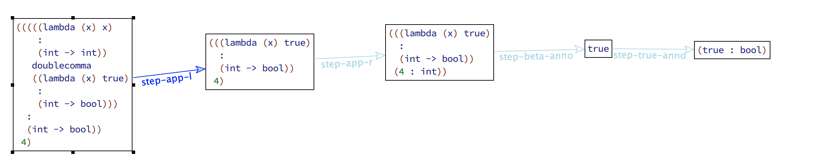
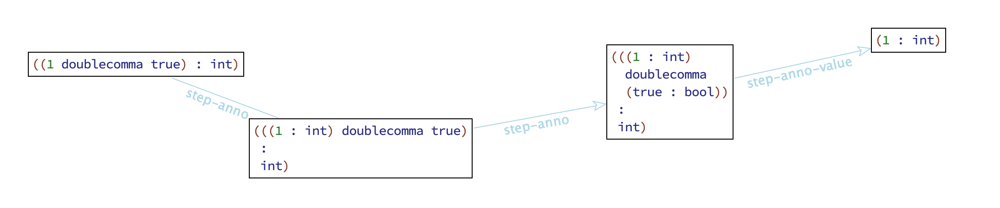

# Applicative Intersection Types

Notes : I heavily use [prettify-symbols](https://github.com/juniorxxue/spacemacs.d/blob/master/utils/prettify-redex.el) in emacs, so Redex code may look werid to you :)

## Table of Contents

* [Style Guide](#style-guide)
* [Syntax](#syntax)
* [Subtyping](#subtyping)
* [Application Subtyping](#application-subtyping)
* [Typed Reduction](#typed-reduction)
* [Reduction](#reduction)
* [Typing](#typing)
* [Ordinary](#ordinary)
* [Disjoint](#disjoint)
* [TopLike](#toplike)

## Style Guide

```haskell
1 
-- (draw (infer empty empty 1 => tau))

1 : Int
-- (draw (infer empty empty (1 : int) => tau))

lambda (x) x : Int -> Int
-- (draw (infer empty empty ((lambda (x) x) : (int -> int)) => tau))

(lambda (x) x) 4
-- (draw (infer empty empty ((lambda (x) x) 2) => tau))

1 ,, true
-- (draw (infer empty empty (1 doublecomma true) => tau))

1 ,, true : Int & Bool 
-- (draw (infer empty empty ((1 doublecomma true) : (int & bool)) => tau))

(succ ,, not : Int -> Int) 5
-- (draw (infer empty empty (((((lambda (x) x) : (int -> int)) doublecomma ((lambda (x) x) : (bool -> bool))) : (int -> int)) 5) => tau))

(succ ,, f : Int -> Bool) 3 : Bool
-- (draw (infer empty empty (((lambda (x) x) : (int -> int)) doublecomma ((lambda (x) true) : (int -> bool))) => tau))

(succ ,, not) 4
-- (draw (check empty empty ((((lambda (x) x) : (int -> int)) doublecomma ((lambda (x) x) : (bool -> bool))) 4) <= int))

(succ ,, not) (4 ,, true)

(f : Int & Bool -> Int & Bool ,, g : String -> String) (4 ,, true)
-- (judgment-holds (check empty empty ((((lambda (x) x) : ((int & bool) -> (int & bool))) doublecomma ((lambda (x) x) : (bool -> bool))) (4 doublecomma true)) <= (int & bool)))

-- would it bother to implement, if we use a check here?
```

## Syntax

### Examples

```haskell
true : Bool is a value
1 : Int is a value
ture : Bool ,, 1 : Int is a value

f : Int -> Int is a value
g : Bool -> Bool is a value
f : Int -> Int ,, g : Bool -> Bool is a value

-- value of merge can be seen as merges of primitive (p : A)
```

### Rules

```
A, B ::= Int | Top | A -> B | A & B
e ::= T | n | x | \x . e | e1 e2 | e1,,e2 | (e : A)
p ::= T | n | \x . e
v ::= p : A | \x . e | v1,,v2
T ::= . | T, x : A
S ::= . | S, A
```


## Subtyping

```
------
A <: B     (Subtyping, rule form)
------

Int <: Int         S-Int


A <: Top           S-Top


Top <: D
----------------   S-TopArr
A <: C -> D


C <: A    B <: D
----------------   S-Arrow
A -> B <: C -> D


A <: B    A <: C
----------------   S-And
A <: B & C


A <: C
----------         S-AndL
A & B <: C


B <: C
----------         S-AndR
A & B <: C
```

## Application Subtyping

### Examples

```
about amiuguity

--------- proposal one open ------------------

S |- A <: D
not (B <: S -> E)
------------------------ AS-AndL
S |- A & B <: D

for arbitrary E, it's not algorithmic, denied

--------- proposal one close ------------------

--------- proposal two open ------------------

S |- A <: D
not (B <: S -> Top)
------------------------ AS-AndL
S |- A & B <: D

S -> Top is top-like type,

(string -> char) <: (int -> top) <- that's not what we want
--------- proposal two close -------------------

--------- proposal three open ------------------

S |- A <: D
not (S <: inputs(B))
------------------------ AS-AndL
S |- A & B <: D


(f: Int -> Int ,, g : Int -> Bool) 4
there's a ambiuguity above
S is Int, B is Int -> Bool, so inputs(Int -> Int) is Int, that works

But what if
(f : Int -> (String -> Int) ,, g : Int -> (Char -> Int)) 4
S is Int here
inputs (Int -> (Char -> Int)) should be Int or Int -> Char?

((f : Int -> (Char -> (String -> Int)) ,, g : Int -> (Char -> (String -> Bool)) 4) 'c'
., Char, Int 
S is probably Int -> Char
inputs (B) is Int? Int -> Char? Int -> Char -> String?
--------- proposal three close ------------------
```

### Rules

```
-----------
S |- A <: B
-----------

. |- A <: A    AS-Refl


C <: A      S |- B <: D
------------------------ AS-Fun
S, C |- A -> B <: C -> D


S |- A <: D
------------------------ AS-AndL
S |- A & B <: D


S |- B <: D
------------------------ AS-AndR
S |- A & B <: D
```

## Typed Reduction

### Examples

```haskell
-- test cases
1 : Int -->Int 1 : Int
\x . x : Int -> Int  -->(Int -> Top) \x . x : Int -> Top

-- merge case

1 : Int -->Int 1 : Int
Ordinary Int
------------------------------------------
(1 : Int) ,, (true : Bool) -->Int  1 : Int


1 : Int -->Int 1 : Int
1 : Int -->Int 1 : Int
--------------------------------------------
1 : Int -->(Int & Int) (1 : Int) ,, (1 : Int)
```

```scheme
;; Redex code
(guess (tred (1 : int) int v) v)
;; => '((1 : int))

(guess (tred ((1 : int) doublecomma (true : bool)) int v) v)
;; => '((1 : int))

(guess (tred (1 : int) (int & int) v) v)
;; => '(((1 : int) doublecomma (1 : int)))
```

```
Discussion about typed reduction

Since reduction need some info from arguments to guide pick from merge.
succ ,, not 4 should reduce to succ

succ ,, not 4 --> succ ,, not (4 : Int)

Option 1 we can use typing to do this

S, A |- typeof (v1 ,, v2) <: B
v1 ,, v2 -->B v1
----------------------------------------------- Step-App-Merge-L
(v1 ,, v2) (p : A) --> v1 (p : A)

One thoughts here, actually the type info of merged term can be get from its term

v1 ,, v2 actually is (p1 : A1) ,, (p2 : A2), the type of it is A1 & A2.

Notes: is (\x .x ,, \x. x : Bool -> Bool) 1 valid?

Option 2 is we can modify the typed reduction so that

A |- v1 ,, v2 -->? v’
----------------------------------------------- Step-App-Merge
(v1 ,, v2) (p : A) --> v’ (p : A)

From Snow's words, Typed Reduction is correlated to subtyping relation,
since we have app-subtyping, it's natural if we introduce a context for typed reduction.

TBD
```

### Rules

```
------------------
v-->A v'
------------------


------------------ Tred-Int-Anno
n : Int -->Int n : Int


Ordinary A
TopLike A
------------------- Tred-Top
e -->A (T : Top)


not (TopLike C)
C <: A
B <: D
----------------------------------------------------- Tred-Arrow-Annotated
(\x . e) : A -> B   -->(C -> D)     (\x . e) : A -> D


e1 -->A e1'
Ordinary A
---------------------------- Tred-Merge-L
e1,,e2 -->A e1'


e2 -->A e2'
Ordinary A
---------------------------- Tred-Merge-R
e1,,e2 -->A e2'


e1 -->A e2
e1 -->B e3
---------------------- Tred-And
e1 -->(A & B) e2,,e3
```
## Reduction

### Examples

```haskell
(\x . x) 4
--> (\x . x) (4 : Int)
--> (4 : Int)

------- Another option (already discarded) --------------
-- (that may be a intuitive one)
-- the problem is
-- system can type check (\x . x) 4
-- while cannot type check (\x . x)
-- so we consider it a special rule
(\x . x) 4
--> (\x . x) (4 : Int)
--> ((\x . x) : (guess Int)) (4 : Int)
--> ((\x . x) : (Int -> Int)) (4 : Int)
------- Another option (already discarded) --------------


-- (f : Int -> Int) ,, (g : Bool -> Bool) 
-- for a merged function, it's already a value
succ ,, not

-- for application with a merged function

-- by meta-function we already have
-- 1) succ ,, not -->(Int -> Int) succ
-- 2) Int | (Int -> Int) & (Bool -> Bool) <: Int -> Int

succ ,, not 4
--> succ ,, not (4 : Int)
--> succ (4 : Int)

(f : Int -> Int) ,, (g : Int -> Bool) :  Int -> Bool
--> f : Int -> Bool -- step-anno-value

-------------- werid case 1 ---------------------------
(1 : Int) : (Int & Int) -- works fine
--> 1 : Int ,, 1 : Int

1 : Int & Int

1 : (Int & Int) -- will be considered as a value
1 : (Int & Int)
--> 1 : Int : (Int & Int)
-- consider make p : A -->A p' : A
-- 1 : Int --> (1 : Int) : Int --> ((1 : Int) : Int) : Int

1 : Int & Int
-------------- werid case 1 ------------------------------
```

```scheme
;; redex code to justify
(traces step (term ((((lambda (x) x) : (int -> int)) doublecomma ((lambda (x) x) : (bool -> bool))) 4)))
(traces step (term ((((lambda (x) x) : (int -> int)) doublecomma ((lambda (x) x) : (bool -> bool))) true)))

(traces step (term ((((lambda (x) x) : (int -> int)) doublecomma ((lambda (x) x) : (int -> bool))) : (int -> bool))))
(traces step (term (((((lambda (x) x) : (int -> int)) doublecomma ((lambda (x) x) : (int -> bool))) : (int -> bool)))))
```







### Rules

```
-------------
e --> e'
-------------

----------------------- Step-Int
n --> n : Int


---------------------------- Step-Beta
(\x . e) v --> (e [x -> v])


v -->A v'
------------------------------------------------ Step-Beta-Anno
((\x . e1) : A -> B) v  --> (e1 [x |-> v'])


v -->A v'
--------------------------------------------- Step-Anno-Value
v : A -> v'


T; S |- v1 ,, v2 => C
S, A |- C <: B
v1 ,, v2 -->B v1
----------------------------------------------- Step-App-Merge-L
(v1 ,, v2) (p : A) --> v1 (p : A)

T; S |- v1 ,, v2 => C
S, A |- C <: B
v1 ,, v2 -->B v2
----------------------------------------------- Step-App-Merge-R
(v1 ,, v2) (p : A) --> v2 (p : A)


e --> e'
------------------ Step-Anno
e : A --> e' : A


e1 --> e1'
------------------ Step-App-L
e1 e2 --> e1' e2


e2 --> e2'
------------------ Step-App-R
v e2 --> v e2'


e1 --> e1'
------------------- Step-Merge-L
e1,,e2 --> e1',,e2


e2 --> e2'
------------------- Step-Merge-R
v,,e2 --> v,,e2'
```

## Typing

### Examples

```


. |- 4 ,, true => Int & Bool       
.; Int & Bool |- (f : Int & Bool -> Int & Bool ,, g : String -> String) => Int & Bool -> Int & Bool
-------------------------------------------------------------------------------------------
(f : Int & Bool -> Int & Bool ,, g : String -> String) (4 ,, true) <= Int & Bool
```

### Rules

```
--------------
T; S |- e => A
T |- e <= A
--------------

syntactic sugar:
T |- e => A   ==   T; . |- e => A


|- T
------------ TInt
T |- n => Int


|- T   x : A \in T
--------------------- TVar
T |- x => A


T, x : A |- e <= B
----------------------------- TLam1
T |- \x. e <= A -> B


T, x : A ; S |- e => B
------------------------------ TLam2
T ; S, A |- \x. e => A -> B


S |- A <: B    T |- e <= A
----------------------------- TAnn
T ; S |- e : A => B


T |- e2 => A   T ; S, A |- e1 => A -> B
----------------------------------------- TApp1
T ; S |- e1 e2 => B


T |- e2 => A    T |- e1 <= A -> B
----------------------------------- TApp2
T |- e1 e2 <= B


T |- e => B     B <: A
------------------------- TSub
T |- e <= A


disjoint A B        T |- e1 => A   T |- e2 => B
----------------------------------------------- TMerge
T |- e1 ,, e2 => A & B
```

## Ordinary

```
-------------
Ordinary A
-------------

------------------ Ord-Top
Ordinary Top


------------------ Ord-Int
Ordinary Int


------------------ Ord-Arrow
Ordinary (A -> B)
```

## Disjoint

```
-----------------
Disjoint A B
-----------------


------------------- Disjoint-Top-L
Disjoint Top A


------------------- Disjoint-Top-R
Disjoint A Top


------------------------- Disjoint-Int-Arr
Disjoint Int (A1 -> A2)


------------------------- Disjoint-Arr-Int
Disjoint (A1 -> A2) Int


Disjoint B1 B2
----------------------------- Disjoint-Arr-Arr
Disjoint (A1 -> B1) (A2 -> B2)


Disjoint A1 B       Disjoint A2 B
------------------------------------ Disjoint-And-L
Disjoint (A1 & A2) B


Disjoint A B1       Disjoint A B2
------------------------------------ Disjoint-And-R
Disjoint A (B1 & B2)
```

## TopLike

```
-------------
TopLike A
-------------

--------------------- TL-Top
TopLike Top


TopLike A
TopLike B
--------------------- TL-And
TopLike (A & B)


TopLike B
-------------------- TL-Arrow
TopLike (A -> B)
```

